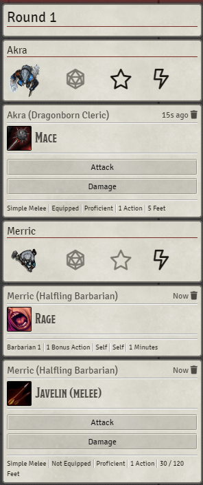

Donations help fund updates and new modules!

# Combat Chat Tracking D&D5e
 
This module adds combat round alerts and turn trackers.

Turn trackers track the combatant's action, bonus action, and reaction for that round.

## Settings

- Rounds Alerts: Enable to create a round alert at the beginning of each round.
- Automatic Tracking: Enable to automatically track actions used during combat. Turn trackers can always be manually edited by GM users or by the combatant's player owner.
- Notify Used Actions: Enable to send a notification to GM users when a character uses an action type they've already used that round. Does not prevent the action from happening.
- Whisper Trackers to GM Users: Enable to have round alerts and turn trackers whispered to GM users. Helps keep player chat logs clear. Hidden combatant turn trackers are automatically whispered.
- GM Mode: Enable to prevent players from manually editting turn trackers. Does not interfere with Automatic Tracking.
